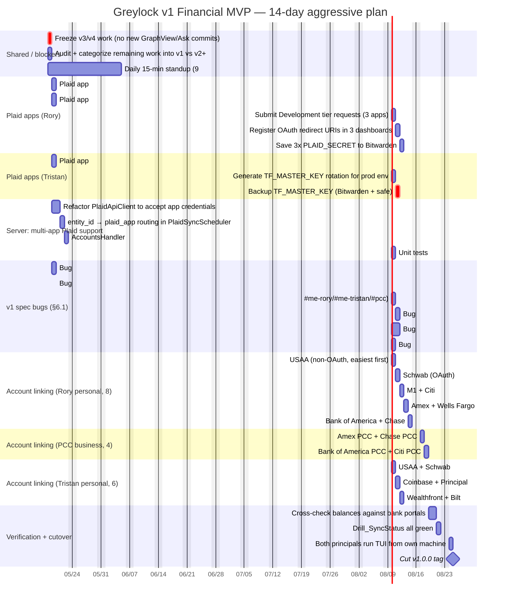

# Greylock — v1 Financial MVP Roadmap

> **Status:** v1 banking surface is ~80% complete per [greylock-spec.md §6.1](greylock-spec.md). This roadmap finishes it.
> **Horizon:** 14 days, aggressive. Sandbox already working; goal is real money flowing end-to-end for all 18 accounts.
> **Authors:** Rory + Tristan.
> **Created:** 2026-05-18.

---

## 0. Why this document exists

Recent `git log` shows six commits in a row on v3/v4 ontology surfaces (GraphView, Decisions, Relationships, Targets, AskView) — work the spec itself defers behind v1. The financial foundation is the priority pillar (whiteboard, in red: **"Priority — financials"**), and v1 is what makes Greylock useful to its two operators today. Everything past v1 compounds, but only if v1 ships.

This roadmap pulls focus back to v1 and defines done.

---

## 1. The MVP, in one sentence

> **Rory and Tristan can log into Greylock, link all of their real bank, credit, brokerage, and retirement accounts through Plaid across three apps (PCC / Rory-personal / Tristan-personal), and see every transaction across personal + business in one categorized, balance-correct dashboard that auto-syncs.**

### 1.1 In scope (v1)

- All 18 listed accounts linked via Plaid Development tier across 3 apps.
- `accounts.balance_cents` correct after every sync.
- Transactions tab shows real transactions, filterable by entity (`#me-rory`, `#me-tristan`, `#pcc`) — keymap `1`/`2`/`3`.
- Dashboard with the four v1 widgets per spec §8.3: **Net Worth**, **Cash Flow This Month**, **Recent Activity**, **Sync & Alerts**.
- Manual refresh (`R` on AccountsView) wired end-to-end.
- 15-minute cron sync running on Tristan's mac; both principals see the same numbers.
- Repo, binary, DB, and docs all named `greylock` (not `terminalfinance`).
- All 4 v1 spec-bugs cleared (§6.1).

### 1.2 Out of scope (defers to v2+)

- Categories tab editing (read-only OK for v1).
- Budget tab beyond what already ships.
- Splits, reimbursements, manual transactions.
- GraphView, AskView, DecisionDetailView, RelationshipDetailView, V3ObjectsHandler — **frozen as-is**; no further work until v1 ships.
- Vault, ingestion pipeline, embeddings, intelligence layer.
- Webhooks, OAuth re-auth flows, Production-tier Plaid (Dev tier covers 100 items; we have ≤18 per app).
- Production hosting migration off Tristan's mac.

### 1.3 Done = all of:

1. `ctest --test-dir build` is green on macOS and Linux self-hosted runner.
2. SQL: `SELECT COUNT(*) FROM accounts WHERE is_plaid_linked = 1` returns 18.
3. SQL: `SELECT SUM(balance_cents) FROM accounts WHERE entity_id = '#pcc'` matches what Rory sees in the PCC banking portals (within rounding).
4. `Drill_SyncStatus` shows all items green within the last 30 minutes.
5. Both Rory and Tristan launch the TUI from their own machines and see the dashboard render in <2s.

---

## 2. The Plaid app structure (locked, per spec Q1)

Three Plaid Developer apps. 100 items free per app; we use ≤18 total.

| Plaid app | Owner of record | Items | Banks |
|-----------|----------------|-------|-------|
| **`greylock-pcc`** | Platinum Creek Capital LLC | 4 | Amex (PCC), Chase (PCC), Bank of America (PCC), Citi (PCC) |
| **`greylock-rory`** | Rory (personal) | 8 | USAA, Schwab, M1, Citi, Amex, Wells Fargo, Bank of America, Chase |
| **`greylock-tristan`** | Tristan (personal) | 6 | USAA, Schwab, Coinbase, Principal, Wealthfront, Bilt |

> **Note on whiteboard label "MI":** assumed to be M1 Finance. Confirm in §6 follow-ups.
> **Note on Bilt:** Bilt is in Plaid's network as a credit card issuer (via Mastercard). If it doesn't appear in Plaid Link's institution search, link the underlying Wells Fargo card and tag-by-product in v2.
> **Note on Coinbase:** Plaid coverage for Coinbase is brokerage-style read-only. Holdings + transactions sync; the wallet view is read-only.

Each Plaid app gets its own `PLAID_CLIENT_ID` and `PLAID_SECRET`. The server reads which app to use from the `entity_id` an account belongs to (see §4.4).

---

## 3. The 14-day Gantt

---

## 4. Phases in prose

### Phase A — Stop the bleeding (Day 1)

The single most important act is to freeze further v3/v4 work until v1 ships. Commit message lock: any commit touching `GraphView`, `AskView`, `DecisionDetailView`, `RelationshipDetailView`, `V3ObjectsHandler`, or anything under `:ask`/`:open` palette commands must reference an open v1 issue or be reverted. Add a `CONTRIBUTING.md` note: **"No v3+ commits until v1.0.0 tag."**

Concrete output of Day 1: a single PR that adds a `v1-freeze` GitHub Actions check that fails on commits touching v3-listed files unless the PR title contains `[v1-ok-touches-v3]` (rare exception case).

### Phase B — Three Plaid apps registered (Days 2–4)

Each principal works independently in their own Plaid dashboard. The PLAID_SETUP.md track-1 playbook applies to each app:

For each of `greylock-pcc`, `greylock-rory`, `greylock-tristan`:
1. Sign up at `https://dashboard.plaid.com/signup` with a dedicated email (suggest `plaid+pcc@greylock.local`, `plaid+rory@…`, `plaid+tristan@…` using plus-addressing on a real inbox).
2. Submit Development-tier use-case form: "Internal multi-entity finance tool. Two principals + one LLC. Not customer-facing." Check products: `transactions`, `auth`, `identity`.
3. Grab `client_id` + `secret`. Save to Bitwarden as `greylock-<app>-plaid-secret` — never paste in chat, Slack, or commits.
4. Register OAuth redirect URI: `https://localhost:8443/link/oauth-return` (and the tailnet hostname `https://greylock.<tailnet>.ts.net:8443/link/oauth-return`).
5. Wait for Development-tier activation (usually same-day, can be overnight).

While Plaid reviews, work the server refactor in §C below — Sandbox keys for all 3 apps work immediately and unblock the code changes.

### Phase C — Server: multi-app Plaid support (Days 2–5)

The current `PlaidApiClient` is single-app. Refactor:

- `PlaidApiClient` constructor takes an `app_id` parameter (`"pcc" | "rory" | "tristan"`). Credentials resolved at construction from env vars `PLAID_CLIENT_ID_PCC`, `PLAID_SECRET_PCC`, etc.
- `PlaidSyncScheduler` maintains one `PlaidApiClient` per app, looks up the right one by walking from `account.entity_id` → entity's `plaid_app` field → the matching client. Add an `entities.plaid_app TEXT` column via a new migration `M005_entity_plaid_app`.
- `AccountsHandler::create` accepts a `plaid_app` query parameter or inherits from entity.
- Unit test in `tests/test_plaid_api_client.cpp`: three stub clients, route by entity, assert calls go to the right one.

Reviewer: this is a security-sensitive change (a routing bug here cross-leaks tokens between principals). Add an assertion in `PlaidTokenBroker::store_token` that the `account_id`'s entity matches the broker's configured app.

### Phase D — v1 spec bugs (Days 2–6)

Four of the five bugs in spec §6.1 remain:

1. **Vestigial shovel widgets + palette aliases removed.** Targets: `src/views/DashboardView.cpp` (any `Shovel*` references), `src/utils/CommandRegistry.cpp` (palette aliases), `tests/test_focus_controller.cpp`. Confirm via `grep -rli shovel src/ tests/` returning zero.
2. **First-run entity seeding rewritten.** `src/main.cpp` should no longer hardcode "Personal" + "Business LLC". Confirm the three canonical entities (`#me-rory`, `#me-tristan`, `#pcc`) are created via the enrollment flow, not at first-run. Cross-check spec §8.2.
3. **`[R]` manual refresh wired.** AccountsView binds `R` → calls `POST /accounts/:id/sync` for the focused account; `Shift-R` → for all visible accounts in current entity. Backend already has the route. Just the client wire.
4. **`terminalfinance` → `greylock` cleanup.** 111 remaining references across 15+ files. Be careful: some are in historical docs (`V0_2_PLAN.md`, `MIGRATION_V0.1_TO_V0.2.md`) and should stay as historical record. Targets to change: `README.md`, `RUNBOOK.md`, `THREAT_MODEL.md`, `WORKFLOW.md`, `PLAID_SETUP.md`, `CONTRIBUTING.md`, `QA_PROMPT.md`, `SECRETS_RECOVERY.md`, source code, test names. Use a careful per-file pass, not a blind sed.

`balance_cents` persistence (the 5th bug) appears already implemented in `PlaidSyncScheduler.cpp:189-207` — the `UPDATE accounts SET balance_cents = ?` is there. **Verify manually:** sync a sandbox account, check the column updates, mark the spec bug stale.

### Phase E — Link all 18 accounts (Days 6–11)

Order matters: easy banks first, OAuth banks second, edge cases last. Each link follows the PLAID_SETUP.md track-2 flow.

**Rory personal (8 items):**
1. USAA (non-OAuth — first link, fastest validation that everything works).
2. Schwab (OAuth).
3. M1 (OAuth).
4. Citi (OAuth).
5. Amex (OAuth).
6. Wells Fargo (OAuth).
7. Bank of America (OAuth).
8. Chase (OAuth).

**PCC business (4 items):**
1. Amex PCC (separate from personal Amex — log in with PCC credentials).
2. Chase PCC (Chase Ink or Chase Business Checking).
3. Bank of America PCC.
4. Citi PCC.

**Tristan personal (6 items):**
1. USAA.
2. Schwab.
3. Coinbase (test brokerage-style read first; confirm holdings + tx flow).
4. Principal (retirement).
5. Wealthfront.
6. Bilt (most likely to fail; fallback is link underlying Wells Fargo card).

For each link, log: institution, item_id (last 4 chars only, never the full id), account count, transaction count after first sync. Drop the log in `docs/LINKING_LOG.md`.

### Phase F — Verification + v1.0.0 cutover (Days 12–14)

- **Balance reconciliation.** Each principal opens each bank's portal, eyeballs the balance, runs `SELECT name, balance_cents FROM accounts WHERE id = '<id>'`, confirms they match within $1.00 (rounding differences between Plaid's "available" vs "current" balance are expected; document any > $1).
- **Drill_SyncStatus pass.** Every item shows green, last_sync within 30 min.
- **Cross-machine test.** Rory launches the TUI from his MacBook, Tristan from his. Both see the same numbers, scoped by entity (`1` shows just `#me-rory`, `2` just `#me-tristan`, `3` just `#pcc`).
- **CI green** on both runners.
- **Backup pass.** `data.db` snapshotted, encrypted, copied to backup target per spec §5.4. `TF_MASTER_KEY` in two secure locations.
- **Tag v1.0.0.** Update README.md status section.

After v1.0.0: v2 (ledger + reimbursements) becomes the next allowed work. v3 (vault) remains gated.

---

## 5. Roles and ownership

| Lane | Owner | Why |
|------|-------|-----|
| Plaid app registrations (3 apps) | Both — each owns their own app | Plaid identity is per-app, per-owner |
| Server multi-app refactor | Tristan | Lives closest to the C++ codebase, MBA constraints willing |
| v1 spec-bug fixes (shovel, rename, entity seed, [R]) | Rory | Lower-risk, parallel-friendly work |
| Account linking ceremony | Owner of each account | You're the one logging into the bank |
| Verification + cutover | Both | Two-key drill for v1.0.0 tag |

If Tristan's bandwidth dips because of MBA, swap server refactor to a paired session over Tailscale and pull the account-linking work earlier on Rory's lane.

---

## 6. Open follow-ups (resolve before Day 3)

1. **Confirm "MI" on the whiteboard.** M1 Finance? Or something else? (If something else, may not have Plaid coverage.)
2. **Bilt Plaid coverage.** Confirm before Day 10 whether Bilt-the-card is link-able directly or routes through Wells.
3. **Email addresses for the 3 Plaid signups.** Plus-addressing on a single Gmail works, but Plaid sometimes rejects plus-addressing on Dev-tier. Have a backup plan with 3 distinct emails if so.
4. **Single mac or two servers during the 14 days?** Spec assumes Tristan's mac is the server. During heavy linking, having Rory run a second server locally for his accounts then merging is an option — discuss Day 1.
5. **`docs/PLAID_SETUP.md` — update to multi-app.** Current playbook is single-app. Update to reference 3 apps and the routing field after Phase C lands.

---

## 7. Stop conditions

The roadmap pauses if any of:

1. A subagent / either principal touches v3+ surfaces (GraphView, AskView, V3) before v1.0.0 tag. **Revert the commit; do not negotiate with drift.**
2. A Plaid Development application is rejected. Drop to Sandbox for that app, file a re-application, continue.
3. An institution refuses to link three times across both principals. Capture the error code, move to next institution, file a v1.1 issue for the failed one.
4. Balance reconciliation in §F differs from bank portal by > $5 on any account. Audit the sync path before tagging.
5. CI is red on either runner for > 4 hours. Stop new work; fix CI first.

---

## 8. After v1.0.0 (preview only — not in scope)

Per spec §6.2–§6.7, the order is:
- **v2 — Ledger** (categories editable, merchants, splits, reimbursements, cross-entity flows, monthly P&L).
- **v3 — Workflow + Vault** (ingestion pipeline, Notes tab, Decisions, Events).
- **v4 — Intelligence Phase 1 + Targets** (RAG, `:ask`, Proposals inbox).
- **v5 — Relationships + personal-life slice + Intelligence Phase 2.**
- **v6 — Forecasts + Intelligence Phase 3 (second brain).**

v3/v4 surfaces already partially built (`GraphView`, `DecisionDetailView`, `RelationshipDetailView`, `V3ObjectsHandler`, `AskView`) survive in tree but are not user-facing in v1. They become the starting point for v2/v3 work after v1 ships.

---

## 9. The whiteboard, restated

From `IMG_6072.heic`: the priority is **financials** (in red). Greylock is the OS; Vault, Ontology, Reasoning are the three pillars; financials is what makes it real today.

From the other whiteboard: PCC's mission is American manufacturing through control of materials and supply, vertical + horizontal integration. Greylock is PCC's nervous system. For Greylock to be PCC's nervous system, it has to know where the money is. v1 is exactly that and nothing more.

> **JARVIS not Ultron** (spec §1.4). v1 ships JARVIS' eyes on your money. The rest of JARVIS gets built once the eyes work.

---

*Last updated: 2026-05-18 by Rory + Claude. Commit to `main` once both principals agree.*
